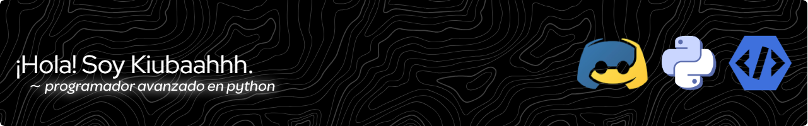

¡Creo que la programación es para TODOS, especialmente para los principiantes!

- 🌱 Desarrollador principiante, apasionado por aprender y crecer en el campo de la tecnología.
- 🛠️ Experiencia moderando servidores de Discord y Minecraft, incluyendo ser parte del staff en "DynamicPvP" (un servidor conocido de HCF en Minecraft).
- 🤖 Actualmente trabajando en la creación de un portafolio de proyectos. ¡Pronto habrá actualizaciones!

  

  

---

### Últimos Proyectos

- `Bot para Discord`: Actualmente estoy desarrollando un bot para Discord publico **source code**. 
- `Administración de Servidores de Minecraft`: Gestioné la participación de la comunidad y la resolución de tickets en "**DynamicPvP**", "**AstroMC**", "**Minegod**", etc...
- `Realización de una tienda virtual`: Realicé una tienda llamada "**Nexus Store**", en aquella tienda se vendían Nitros, Boosts, Cuentas de juegos, etc...

---

### Colaboraciones

- _¡Próximamente!_ Si te gustaría colaborar, no dudes en contactarme.

---

### ¡Conectemos!

- **Twitter**: [@_kiubaahhh](http://twitter.com/_kiubaahhh)
- **Instagram**: [@_kiubaahhh](http://instagram.com/_kiubaahhh)
- **Discord**: [_kiubaahhh]()
- **YouTube**: [@Kiubaahhh](https://youtube.com/kiubaahhh)

---

¡Espero poder colaborar y aprender con todos en la comunidad de código abierto!

